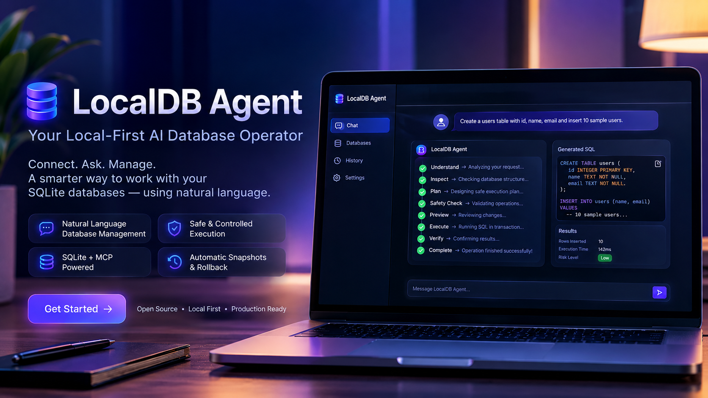

# LocalDB Agent

**Git for AI database operations.** A local-first AI database operator that connects to
SQLite databases through the **Model Context Protocol (MCP)** and lets you manage them
safely with natural language.

It is *not* a text-to-SQL chatbot. Every request runs through an agentic pipeline:

```
Understand → Inspect → Plan → Safety Check → Preview → Execute → Verify → Complete
```

Each step is shown live as an animated execution timeline, with generated SQL, affected
tables/rows, risk level, execution duration, verification results, and before/after schema
diffs. Destructive operations require explicit confirmation, run inside a transaction, and
are protected by an automatic pre-mutation snapshot so you can **Undo / Rollback**.

---

## Highlights

| | |
|---|---|
| **Agentic workflow** | 9-stage pipeline with streamed reasoning, streamed SQL, and a live timeline |
| **Truthful preview** | every plan runs first against a throwaway in-memory clone — you see the real result, real schema/row diff, real verification outcomes, real failures — before anything touches your database |
| **Safe by construction** | static SQL analysis, risk scoring, hard-blocked statements, parameterised reads, transaction boundaries, read/write separation |
| **Command palette** | ⌘K / Ctrl-K for connect, switch DB, new conversation, re-run, theme |
| **Snapshots & undo** | online-backup checkpoint before every mutation; one-click rollback |
| **Schema intelligence** | explorer with tables / columns / row counts / indexes / FKs, and structural before/after diffs |
| **MCP-native** | the database capability layer is a standalone MCP server — external clients get the same guarantees |
| **Free by default** | offline heuristic planner needs no API key; optional Ollama / Anthropic / OpenAI |
| **Polished UI** | Next.js + shadcn-style components + Framer Motion, dark/light, responsive |

## Stack

Next.js 15 (App Router) · React 19 · TypeScript · Tailwind + shadcn-style UI · Framer Motion ·
`@modelcontextprotocol/sdk` · Drizzle ORM · `better-sqlite3` · Zod · Server-Sent Events

---

## Quick start

```bash
npm install
cp .env.example .env          # optional — defaults work with zero config
npm run seed                  # creates databases/demo.db
npm run dev                   # http://localhost:3000
```

Open the app, connect `demo.db`, and try:

> *Create a suppliers table with id, name, email and insert 10 sample suppliers*
>
> *Show all customers in Berlin*
>
> *Delete from orders where status = 'cancelled'*  ← will ask for confirmation

### Production

```bash
npm run build
npm run db:migrate            # apply Drizzle migrations to the app metadata DB
node .next/standalone/server.js
```

### Docker

```bash
docker compose up --build     # http://localhost:3000
```

Databases live in `./databases` (bind-mounted); app metadata + snapshots in the
`localdb-data` volume.

---

## Configuration

All optional — see [`.env.example`](.env.example). Key variables:

| Variable | Default | Purpose |
|---|---|---|
| `LOCALDB_DB_ROOT` | `./databases` | sandbox root; database paths outside it are rejected |
| `LOCALDB_DATA_DIR` | `./data` | app metadata DB + snapshot files |
| `LLM_PROVIDER` | `heuristic` | `heuristic` \| `ollama` \| `anthropic` \| `openai` |
| `OLLAMA_BASE_URL` / `OLLAMA_MODEL` | `localhost:11434` / `llama3.1` | free local LLM planning |
| `ANTHROPIC_API_KEY` / `OPENAI_API_KEY` | — | enable hosted planners |
| `LOCALDB_MAX_PREVIEW_ROWS` | `200` | cap on rows returned per read |
| `LOCALDB_SANDBOX_MAX_MB` | `200` | skip the clone above this DB size (static preview only) |
| `LOCALDB_SANDBOX_SAMPLE_ROWS` | `10` | sample changed rows shown from a preview |
| `LOCALDB_REQUIRE_CONFIRM_ALL` | `false` | require confirmation for every mutating op, not just risky ones |

If a configured LLM is unreachable, the app automatically falls back to the offline
heuristic planner and tells you in the UI.

---

## Architecture

Modular services, each independently testable:

```
src/lib/
  config.ts              env + paths
  db/                    Drizzle schema + app metadata SQLite (isolated from user DBs)
  sqlite/
    path-safety.ts       path-traversal / extension / URI rejection
    connection-manager.ts one isolated pooled connection per file
    introspect.ts        schema + row-count capture
    diff.ts              structural before/after diff
    safety.ts            statement splitter, classifier, risk model, hard blocks
    executor.ts          parameterised run + single-transaction batch
    snapshot.ts          online-backup checkpoint + restore
  mcp/
    tools.ts             the canonical capability layer (Zod-validated)
    server.ts            MCP server wrapper
    client.ts            in-process client used by the agent
  agent/
    providers/           heuristic | ollama | anthropic | openai (+ fallback)
    prompts.ts           system/user prompt + schema serialisation
    orchestrator.ts      the 9-stage pipeline as an async event generator
  repo.ts                metadata CRUD (databases, conversations, messages, operations, snapshots)
  sse.ts                 AsyncGenerator → text/event-stream
```

The UI (`src/components/*`) consumes SSE and never touches SQLite directly. The agent
orchestrator calls `mcp/client.ts`, which calls the exact same `mcp/tools.ts` registry the
standalone MCP server exposes — so external MCP clients inherit every safety guarantee.

### Sandbox preview

`sqlite/sandbox.ts` clones the database with `VACUUM INTO` a scratch file, loads the bytes
into a private in-memory SQLite instance, deletes the scratch file, runs the plan in a
transaction on the clone, and captures: real `StatementResult`s, a real `SchemaDiff`, a
row-level diff (added / removed / changed rows keyed on `rowid`) with samples, and real
verification results. Nothing is written back. If the plan would fail (constraint
violation, bad column, …) the pipeline stops at **Preview** and never creates a
mutating operation. Databases larger than `LOCALDB_SANDBOX_MAX_MB` skip the clone and
fall back to static analysis.

### Safety model

- **Hard-blocked** regardless of confirmation: `ATTACH/DETACH DATABASE`, `load_extension`,
  `PRAGMA writable_schema`, `VACUUM INTO`.
- **Risk scoring**: `safe → low → moderate → high → critical`. `UPDATE`/`DELETE` without a
  `WHERE` jump to `high`; `DROP` is `critical`.
- **Confirmation gate**: any destructive statement or `high`+ risk stops the pipeline and
  persists an `awaiting_confirmation` operation until you approve.
- **Transactions**: every batch runs in one `better-sqlite3` transaction — any failure
  rolls the whole batch back, nothing is committed.
- **Snapshots**: a physical file checkpoint (WAL-truncated copy) is taken before mutations;
  `Undo` closes connections, restores the file, and marks the snapshot consumed.
- **Reads** are parameterised and run on a `readonly` connection.

---

## Using the MCP server standalone

```bash
npm run mcp:stdio
```

Example client config (Claude Desktop / any MCP client):

```json
{
  "mcpServers": {
    "localdb-agent": {
      "command": "npx",
      "args": ["tsx", "src/bin/mcp-stdio.ts"],
      "env": { "LOCALDB_DB_ROOT": "/absolute/path/to/databases" }
    }
  }
}
```

Tools: `list_tables`, `describe_table`, `schema_snapshot`, `query` (read-only),
`dry_run` (static analysis, executes nothing), `preview` (runs the SQL on a throwaway
in-memory clone and returns the real statement results, schema diff, row-level changes and
verification outcomes — the real database is never touched), `execute` (transactional,
auto-snapshot, `confirmDestructive` required for destructive SQL), `restore_snapshot`.

---

## Scripts

| Script | Description |
|---|---|
| `npm run dev` / `build` / `start` | Next.js |
| `npm run seed` | build `databases/demo.db` |
| `npm run db:generate` / `db:migrate` / `db:studio` | Drizzle |
| `npm run mcp:stdio` | standalone MCP server |
| `npm test` / `test:watch` | Vitest (safety model, path safety, full pipeline) |
| `npm run typecheck` / `lint` | TypeScript / ESLint |

## Tests

```bash
npm test
```

Covers the statement splitter (string/comment aware), classifier, risk model, hard blocks,
path-traversal rejection, and an end-to-end plan→execute→verify→rollback cycle on a temp DB.

See [DEPLOYMENT.md](DEPLOYMENT.md) for production notes.

## License

MIT — see [LICENSE](LICENSE).
